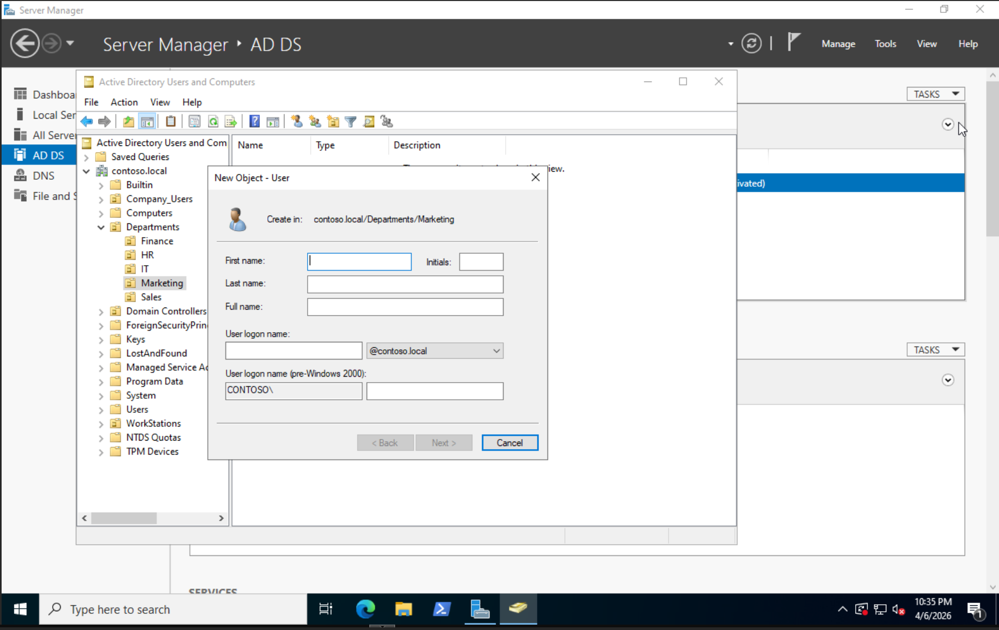

# Active-Directory-Simulation-Lab
This project documents the deployment and configuration of a fully functional Windows Server 2016 Active Directory environment virtualized on Proxmox VE. The goal was to build a secure, scalable sandbox to practice enterprise identity management, Group Policy implementation, and virtualized network troubleshooting.

## 🛠️ Technical Specifications
* **Hypervisor:** Proxmox VE
* **Operating System:** Windows Server 2016 (Standard Desktop Experience)
* **Domain Name:** contoso.local (Simulated Enterprise Environment)
* **Client OS:** Windows 10/11 Pro (Domain-Joined)

## 📂 Directory Architecture (OU Design)
I moved away from the default 'Users' container to a dedicated **'Departments' OU** structure. This allows for granular GPO targeting and matches real-world enterprise standards.

* **Logic:** Users are sorted into sub-OUs (IT, Finance, Marketing) to ensure departmental policies (like network drives) are applied only to the intended recipients.

## 🔐 Group Policy Management (GPOs)
Implemented the following policies to harden the environment and improve user experience:
1. **Automated Drive Mapping:** Uses GPO Preferences to map the `S:` Drive to departmental file shares.
2. **Restricted Local Admins:** Removed 'Domain Users' from local administrator groups on workstations to enforce the **Principle of Least Privilege**.

## 🛠️ Critical Troubleshooting: DNS & Domain Connectivity

**The Challenge:**
During the workstation provisioning phase, a Windows 11 client failed to join the `lab.local` domain. The error message indicated that the "Domain Controller could not be contacted," despite both machines being powered on and connected to the same virtual switch in Proxmox.

**The Diagnostic Process:**
1. **Connectivity Test:** I utilized `ping` to test connectivity. While I could ping the Server's IP address, I could NOT ping the domain name (`ping contoso.local`).
2. **IP Configuration Audit:** I ran `ipconfig /all` on the client and discovered the DNS server was pointing to the local gateway (the home router) rather than the Domain Controller. 
3. **The Root Cause:** The client was receiving a dynamic IP via DHCP from the virtulaized router, which lacked the DNS records for my private lab environment.

**The Resolution:**
* **Manual Configuration:** I assigned a **Static IP** to the Windows Client and manually set the **Preferred DNS Server** to the IP address of the Domain Controller.
* **DNS Cache Clear:** Ran `ipconfig /flushdns` to clear any stale records.
* **Verification:** Successfully joined the domain on the next attempt and verified the computer object appeared in the `Computers` container in Active Directory.

**Key Learning:** Active Directory is entirely dependent on DNS. A client must "ask" the Domain Controller where the domain is; if it asks the internet (8.8.8.8) or a home router, it will never find a local `.local` lab.
